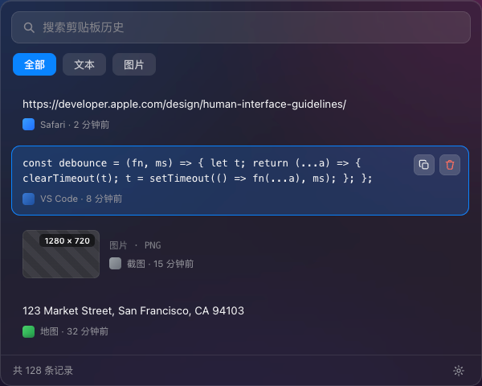
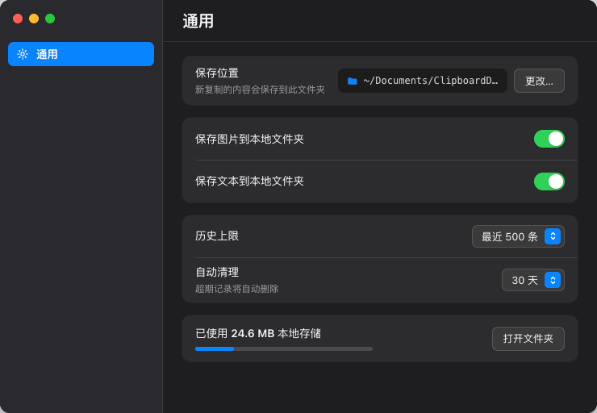

# Recall

> 常驻菜单栏的 macOS 剪贴板管理工具。复制过的文本和图片自动保存到**本地文件夹**，随时用全局快捷键唤起浮层面板浏览、搜索、重新复制。

核心定位：**数据存本地、用户掌控存储位置**——区别于把数据锁在应用内部数据库里的同类工具。文本以 `.md`、图片以 `.png` 落地为独立文件，你在 Finder 里就能直接看到、备份、用别的工具处理。

<p align="center">
  
  
</p>

## 功能

- **自动捕获** — 轮询 `NSPasteboard`，复制文本/图片即记录，按内容 SHA-256 去重
- **本地文件夹存储** — 正文落地为独立文件（`texts/*.md`、`images/*.png`），元数据走 SQLite 索引，面板秒开
- **历史面板** — 全局快捷键（默认 ⌥V）唤起毛玻璃浮层，搜索 + 全部/文本/图片筛选，点击即重新复制
- **菜单栏下拉** — 最近 5 条 + 打开面板 / 设置 / 退出
- **设置** — 更改保存路径（含数据迁移、可回滚）、保存开关、历史上限、按时间自动清理、自定义快捷键
- **隐私优先** — 命中 `org.nspasteboard.ConcealedType`（密码管理器等标记的敏感内容）跳过不记录；数据只存本地，不上传、不进日志
- **深色模式** — 浅色/深色双版本

## 技术栈

- Swift 5.9+，macOS 13+（Ventura）
- SwiftUI（历史面板/设置）+ AppKit（菜单栏、无边框浮层窗口）
- 菜单栏常驻应用：`LSUIElement = true`，无 Dock 图标、无主窗口
- 全局快捷键：[`sindresorhus/KeyboardShortcuts`](https://github.com/sindresorhus/KeyboardShortcuts)（底层 Carbon `RegisterEventHotKey`，无需辅助功能权限）
- 索引：系统自带 `libsqlite3` 薄封装，零外部依赖

详见 [TECH_DESIGN.md](./TECH_DESIGN.md)。

## 目录结构

```
Recall/
├── App/          # AppDelegate、菜单栏入口、浮层/设置窗口控制、生命周期
├── Clipboard/    # ClipboardMonitor：监听、类型识别、去重
├── Storage/      # ClipboardStore、SQLiteIndex、文件读写、路径迁移
├── Features/     # History / Settings / MenuBar，每个功能一个子目录
├── Models/       # ClipItem、AppSettings
└── Assets.xcassets
```

所有数据读写只走 `Storage/ClipboardStore`，UI 层不直接碰文件系统或剪贴板。

## 构建与运行

```bash
cd Recall
# 编译
xcodebuild -scheme Recall -configuration Debug build
# 测试
xcodebuild -scheme Recall -destination 'platform=macOS' -only-testing:RecallTests test
```

或用 Xcode 打开 `Recall/Recall.xcodeproj` 直接运行。

## 许可

个人项目，暂未指定开源许可。
